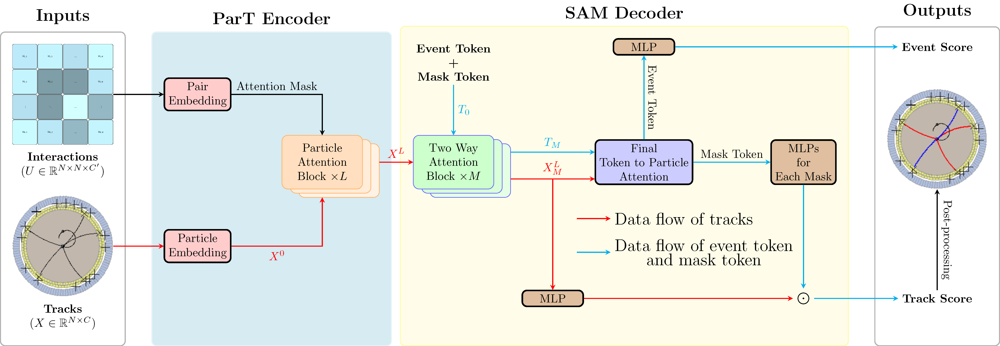
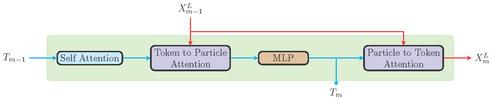

# ResoSeg

## Overview

ResonanceSegmenter (ResoSeg) is a deep learning model that jointly performs particle-level segmentation 
and event-level classification, enabling a one-pass analysis of resonance to anything decays while 
precisely reconstructing the relevant resonance properties.

<center>The architecture of ResoSeg</center>


<center>The architecture of Two way attention block</center>

## Install

Clone the repository from Git and enter the project directory:

```bash
git clone https://github.com/oashen/ResoSeg.git
cd EtacTagger
```

We recommend using Conda to manage the ResoSeg environment. First, create and activate the environment:

```bash
conda create --name ResoSeg_gpu python=3.10.18 pytorch pandas uproot mplhep scikit-learn numpy matplotlib
conda activate ResoSeg_gpu
```

Then install the remaining Python dependencies:

```bash
pip install pytorch_lightning weaver-core
```

If you need ROOT, install it on Linux with the following command:

```bash
conda install -c conda-forge root
```

For instructions on installing ROOT and associating it with the Python version on Windows and macOS, see the [official ROOT installation documentation](https://root.cern.ch/install/).

Finally, install this repository in editable mode with pip:

```bash
pip install -e .
```

