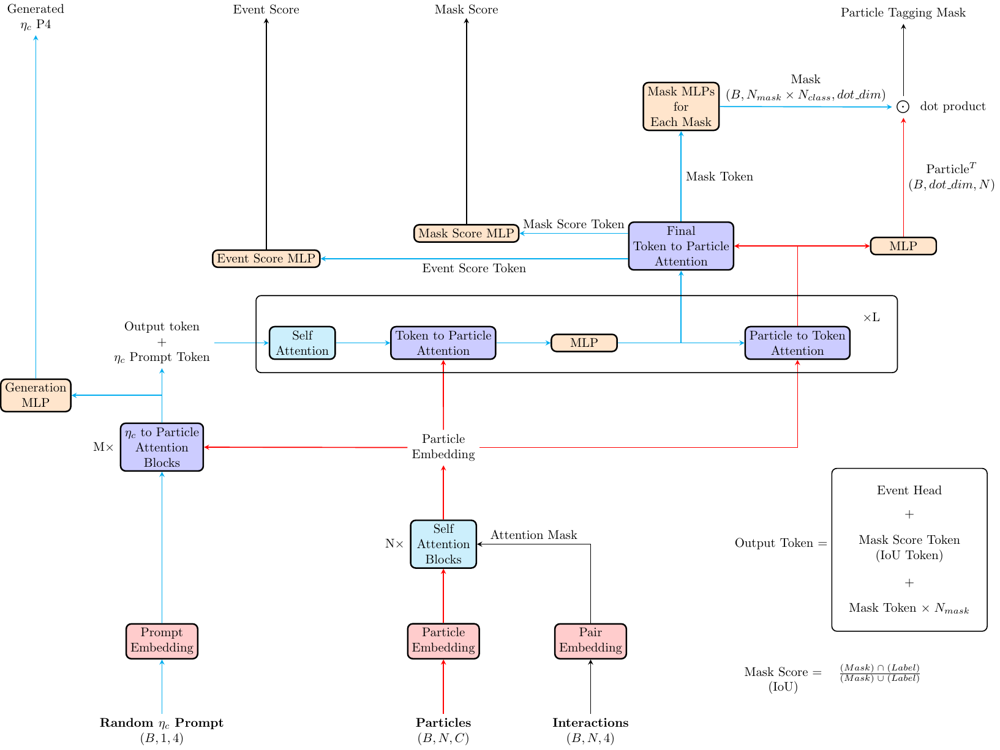
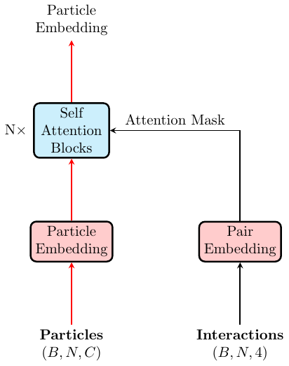
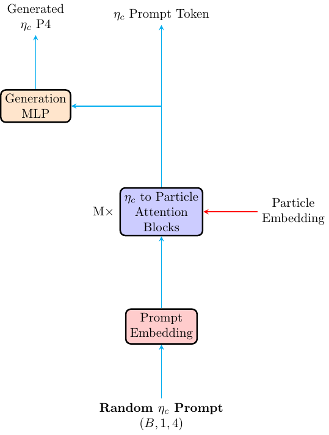
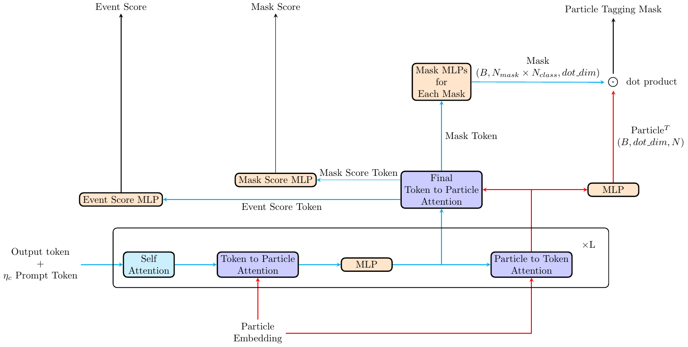

# EtacTagger

## Overview

EtacTagger is a model that can tag the $\eta_c$ resonance in BESIII experiment. It can tell whether an event contain a $\eta_c$. 
And if there is a $\eta_c$ resonance, it can tell witch tracks come from $\eta_c$, and witch real tracks not from $\eta_c$, and
 witch are the false tracks.

## Encoder

The Encoder draws inspiration from the model architecture of [ParT](https://arxiv.org/abs/2202.03772). 
It accepts two inputs: particle input in the form of (batch size, $N_{particle}$, $N_{feat}$) and interaction input 
witch contain the unnormalized four-momentum of input particles. The output will be in the form of (batch size, $N_{particle}$, embed dims).

## GenP4

### Prove to have no effect !!!

The GenP4 block is an optional block that can generate the four-momentum of the $\eta_c$ resonance, 
the generated four-momentum can be used as prompt in the decoder. if the gen_layers <= 0, the GenP4 block will not be activated.
 The input of this block is randomly generated within the block, and the output in the form of (batch size, 4) for Generated $\eta_c$ P4
 and (batch size, 1, embed dims) for $\eta_c$ Prompt Token

## Tagging Decoder

The Tagging Decoder draws inspiration from the model architecture of [SAM](https://ai.meta.com/research/publications/segment-anything/).
 It accepts the Particle Embedding and any event level prompt token in the form of (batch size, N, embed dims). The Output Token
contains the event classification head, the mask score head and multiple tagging mask head. The Event Score is the event level
 classification result in the shape of (batch size, 2), while the Particle Tagging Mask is the particle level classification
 result (or particle tagging result) in the shape of (batch size, $N_{mask}$, $N_{particle}$, $N_{class}$). The Mask Score is 
the generated IoU score for each mask, it has a shape of (batch size, $N_{mask}$) and suppose to be able to evaluate the goodness of 
a tagging mask. $IoU=\frac{Preadict\;Mask \;\cap\; Real \; Label}{Preadict\;Mask \;\cup\; Real \; Label}$.